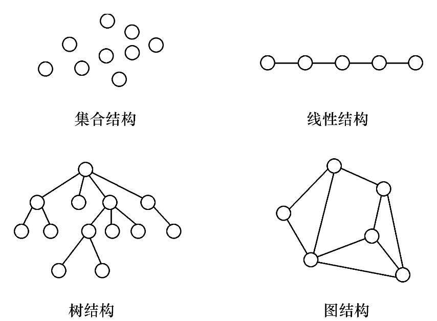

# 数据结构

## 第一章 绪论

如何合理的组织数据、高效地处理数据。

### 1.1 数据结构的研究内容

数据结构主要研究非数值计算问题，非数值问题无法用数学方程建立数学模型。

### 1.2 基本概念和术语

#### 1.2.1 数据、数据元素、数据项和数据对象

**数据** 是客观事物的符号表示，是所有能输入到计算机中并被计算机程序处理的符号的总称。  
**数据元素** 是数据的基本单位，在计算机中通常作为一个整体进行考虑和处理。  
**数据项** 是组成数据元素的、有独立含义的、不可分割的最小单位。  
**数据对象** 是性质相同的数据元素的集合，是一个数据的子集。  

### 数据结构

**数据结构** 是相互之间存在一种或多种特定关系的数据元素的集合。  

数据结构包括逻辑结构和存储结构两个层次。

1. 逻辑结构  

**逻辑结构** 是从逻辑关系是描述数据，它与数据的存储无关，是独立于计算机的。  
数据的逻辑结构有两个要素：一是数据元素；二是关系。  

根据数据元素之间关系的不同特征，通常有四类基本结构，它们的复杂程度依次递进。  



（1）集合结构  
数据元素之间除了“属于同一集合”的关系外，别无其他关系。  

（2）线性结构  
数据元素之间存在一对一的关系。  

（3）树结构  
数据元素之间存在一对多的关系。  

（4）图结构或网状结构  
数据元素之间存在多对多的关系。  

其中集合结构、树结构和图结构都属于非线性结构。  

2. 存储结构  

数据对象在计算机中的存储表示称为数据的**存储结构**，也称为**物理结构**。  
数据元素在计算机中有两种基本的存储结构，分别是顺序存储结构和链式存储结构。  

（1）顺序存储结构  
顺序存储结构是借助元素在存储器中的相对位置来表示数据元素之间的逻辑关系，通常借助程序设计语言的数组类型来描述。  

（2）链式存储结构  
顺序存储结构要求所有的元素依次存放在一片连续的存储空间中，而链式存储结构，无需占用一整块存储空间。  
为了表示结点之间的关系，需要给每个结点附加指针字段，用于存放后继元素的存储地址。所以链式储存结构通常借助于程序设计语言的指针类型来描述。  

#### 1.2.3 数据类型和抽象数据类型

1. 数据类型

**数据类型**是一个值的集合和定义在这个值集上的一组操作的总称。

2. 抽象数据类型

**抽象数据类型**一般指由用户定义的、表示应用问题的数学模型，以及定义在这个模型上的一组操作的总称，具体包括三部分：数据对象、数据对象上的关系的集合以及对数据对象的基本操作的集合。

抽象数据类型的定义格式如下：

```
ADT 抽象数据结构类型名{
	数据对象：<数据对象的定义>
	数据关系：<数据关系的定义>
	基本操作：<基本操作的定义>
}ADT 抽象数据结构类型名
```

其中，数据对象和数据关系的定义采用数学符号和自然语言描述，基本操作的定义格式为：

```
基本操作名(参数表)
	初始条件：<初始条件描述>
	操作结果：<操作结果描述>
```

### 1.3 抽象数据类型的表示与实现

（1）预定义常量及类型：

```c
// 函数结果状态代码
#define OK 1
#define ERROR 0
#define OVERFLOW -2
// Status 是函数返回值类型，其值是函数结构状态代码。
typedef int Status;
```

（2）数据结构的表示（存储结构）用类型定义（typedef）描述；数据元素类型约定为ElemType。由用户在使用该数据类型时自行定义。  

（3）基本操作的算法都用如下格式的函数来描述：

```
数据类型 函数名（函数参数表）
{
	// 算法说明
	语句序列
} // 函数名
```

当函数返回值为函数结果状态代码时，函数定义为Status类型。

（4）内存的动态分配与释放。

使用new和delete动态分配和释放内存空间：

```
分配空间：
指针变量 = new 数据类型;
释放空间:
delete 指针变量;
```

### 1.4 算法和算法分析

#### 1.4.1 算法的定义及特性

**算法**是为了解决某类问题而规定的一个有限长的操作序列。

一个算法必须满足以下五个重要特性：  
1. 有穷性。  
2. 确定性。  
3. 可行性。  
4. 输入。  
5. 输出。  

#### 1.4.2 评价算法优劣的基本标准

一个算法的优劣应该从以下几方面来评价：  
1. 正确性。  
2. 可读性。  
3. 健壮性。  
4. 高效性。  

高效性包括时间和空间两个方面。时间高效是指算法设计合理，执行效率高，可以用时间复杂度来衡量；空间高效是指算法占用存储容量合理，可以用空间复杂度来衡量。时间复杂度和空间复杂度是衡量算法的两个主要指标。

#### 1.4.3 算法的时间复杂度

为了客观地反应一个算法的执行时间，可以只使用算法中的“基本语句”的执行次数来度量算法的工作量。所谓“基本语句”指的是算法中重复执行次数和算法的执行时间成正比的语句，它对算法运行时间的贡献最大。  

一般情况下，算法中基本语句重复执行的次数是问题规模*n*的某个函数$f(n)$，算法的时间度量记作:
$$
T(n)=O(f(n))
$$
它表示随问题规模*n*的增大，算法执行时间的增长率和$f(n)$的增长率相同，称作算法的**时间复杂度**。

数学符号“$O$”的严格定义为：  
若$T(n)$和$f(n)$是定义在正整数集合上的两个函数，则$T(n)=O(f(n))$表示存在正的常数$C$和$n_0$，使得当$n\ge n_0$时都满足$0\le T(n)\le Cf(n)$。  
该定义说明了函数$T(n)$和$f(n)$具有相同的增长趋势。符号“$O$”用来明书增长率的上限，它表示当问题规模$n\g n_0$时，算法的执行时间不会超过$f(n)$。

常见的时间复杂度按数量级递增排列依次为：常量阶$O(1)$、对数阶$O(log_2 n)$、线性阶$O(n)$、线性对数阶$O(nlog_2 n)$、平方阶$O(n^2)$、立方阶$O(n^3)$、……、k次方阶$O(n^k)$、指数阶$O(2^n)$等。

#### 1.4.4 算法的空间复杂度

对于输入数据所占的具体存储量取决于问题本身，与算法无关，只需分析该算法在实现时所需要的辅助空间。通常情况下，鉴于运算空间较为充足，都以算法的时间复杂度作为算法优劣的衡量指标。

### 1.5 小结

1. 数据结构包括两个方面的内容：数据的逻辑结构和存储结构。同一逻辑结构采用不同的存储方法，可以得到不同的存储结构。  
(1) 逻辑结构是从具体问题抽象出来的数学模型，从逻辑关系上描述数据，它与数据的存储无关。根据数据元素之间关系的不同特性，通常有四类基本逻辑结构：集合结构、线性结构、属性结构和图状结构。  
(2) 存储结构是逻辑结构在计算机中的存储表示，有两类存储结构：顺序存储结构和链式存储结构。  

2. 抽象数据类型是指用户定义的、表示应用问题的数学模型，以及定义在这个模型上的一组操作的总称，具体包括三个部分：数据对象、数据对象上关系的集合，以及对数据对象的基本操作的集合。

3. 算法是为了解决某类问题而规定的一个有限长的操作序列。  
算法具有五个特性：有穷性、确定性、可行性、输入和输出。  
一个算法的优劣应该从以下四方面来评价：正确性、可读性、健壮性和高效性。

4. 算法分析的两个主要方面是分析算法的时间复杂度和空间复杂度。将算法的时间复杂度作为分析的重点。算法执行时间的数量级称为算法的渐进时间复杂度，$T(n)=O(f(n))$。

要求掌握数据结构相关的概念，包括数据、数据元素、数据项、数据对象、数据结构、逻辑结构、存储结构等；  
重点掌握数据结构所含两个层次的具体含义及其相互关系；  
重点掌握算法时间复杂度的分析方法。

## 第二章 线性表

线性表属于线性结构，线性结构的基本特点是除第一个元素无直接前驱，最后一个元素无直接后继之外，其他每个数据元素都有一个前驱和后继。  
线性表是最基本最常用的一种线性结构，同时也是其他数据结构的基础，尤其单链表，是贯穿整个数据结构课程的基本技术。

### 2.1 线性表的定义和特点。

由$n(n\ge 0)$个数据特性相同的元素构成的有限序列称为**线性表**。线性表中元素的个数$n(n\ge 0)$定义为线性表的长度，$n=0$时称为**空表**。

对于非空的线性表或线性结构，其特点是：  
1. 存在唯一的一个被称作“第一个”的数据元素；  
2. 存在唯一的一个被称为“最后一个”的数据元素；  
3. 除第一个之外，结构中的每个数据元素均只有一个前驱；  
4. 除最后一个之外，结构中的每个数据元素均只有一个后继。

[ADT List](./List/ADT.md)

### 2.4 线性表的顺序表示和实现

#### 2.4.1 线性表的顺序存储表示

线性表的顺序表示指的是用一组地址连续的存储单元依次存储线性表的数据元素，这种表示也称作线性表的顺序存储结构。  
称这种结构的线性表为**顺序表**。其特点是，逻辑上相邻的数据元素，其物理次序也是相邻的。  

假设线性表的每个数据元素只用$I$个存储单元，并以所占的第一个单元的存储地址作为数据元素的存储起始位置。  
则线性表中第$i+1$个数据元素的存储位置$LOC(a_{i+1})$和第$i$个数据元素的存储位置$LOC(a_i)$之间满足下列关系：

$$
LOC(a_{i+1})=LOC(a_i)+I
$$

一般地，线性表的第$i$个数据元素$a_i$的存储位置为：  

$$
LOC(a_i) = LOC(a_1)+(i-1)\times I
$$

$LOC(a_1)$是线性表的第一个数据元素$a_1$的存储位置，通常称作线性表的起始位置或基地址。  
只要确定了存储线性表的其实位置，线性表中任一数据元素都可以随机存取，所以线性表的顺序存储结构是一种**随机存取**的存储结构。

通常使用数组来描述数据结构中的顺序存储结构。由于线性表的长度可变，且需要的最大存储空间随问题不同而不同，在C语言中可用动态分配的一维数组表示线性表，描述如下：

```C
//-----顺序表的存储结构-----
#define MAXSIZE 100				// 顺序表可能达到的最大长度
typedef struct
{
	ElemType *elem;				// 存储空间的基地址
	int length;					// 当前长度
}SqList;						// 顺序表的结构类型为SqList
```

在上述定义后，可以通过变量定义语句

```C
SqList L;
```

将`L`定义为`SqList`类型的变量，便可以利用`L.elem[i-1]`访问表中位置序号为$i$的数据元素。

#### 2.4.2 顺序表中基本操作的实现

##### 算法2.1 顺序表的初始化

构造一个空的顺序表。  

【算法步骤】
1. 为顺序表L动态分配一个预定义大小的数组空间，使elem指向这段空间的基地址。  
2. 将表的当前长度设为0。

【算法描述】

```c++
Status InitList(SqList &L)
{// 构造一个空的顺序表L
    L.elem = new ElemType[MAXSIZE];     // 为顺序表分配一个大小为MAXSIZE的数组空间
    if(!L.elem)
        exit(OVERFLOW);                 // 存储分配失败退出
    L.length=0;                         // 空表长度为0
    return OK;
}
```

##### 算法2.2 顺序表的取值

根据指定的位置序号i，获取顺序表中第i个元素的值。

【算法步骤】

1. 判断指定的位置序号i值是否合理$(1\le i \le L.length)$，若不合理，则返回ERROR。  
2. 若i值合理，则将第i个数据元素L.elem[i-1]赋给参数e，通过e返回第i个数据元素的传值。

【算法描述】

```c++
Status GetElem(SqList L, int i, ElemType &e)
{// 获取顺序表第i个元素值
    if(i<1 || i>L.length)       // 判断i值是否合理，若不合理，返回ERROR
        return ERROR;
    e = L.elem[i-1]             // elem[i-1]单元存储第i个数据元素
    return OK;
}
```

【算法分析】

顺序表取值算法的时间复杂度为$O(1)$。

##### 算法2.3 顺序表的查找

根据指定的元素值e，查找顺序表中第1个与e相等的元素。  
若查找成功，则返回该元素在表中的位置序号；若查找失败，则返回0。  

【算法步骤】

1. 从第一个元素起，依次和e相比较，若找到与e相等的元素L.elem[i]，则查找成功，返回该元素的序号i+1。  
2. 若查遍整个顺序表都没有找到，则查找失败，返回0。

【算法描述】

```c++
int LocateElem(SqList L, ElemType e)
{// 在顺序表中查找值为e的数据元素，返回其序号
    for(i=0; i<L.length; i++)
        if(L.elem[i]==e)
            return i+1;         // 查找成功，返回序号i+1
    return 0;                   // 查找失败，返回0
}
```

【算法分析】

顺序表按值查找算法的平均时间复杂度为$O(n)$。

##### 算法2.4 顺序表的插入

在表的第i个位置插入一个新的数据元素e。  
一般情况下，在第i$(1 \le i \le n)$个位置插入一个元素时，需从最后一个元素即第n个元素开始，依次向后移动一个位置，直至第i个元素（共移动$n-i+1$个元素）。  

【算法步骤】

1. 判断插入位置i是否合法（i值的合法范围是$1 \le i \le n+1$），若不合法则返回ERROR。  
2. 判断顺序表的存储空间是否已满，若满则返回ERROR。  
3. 将第n个至第i个位置的元素依次向后移动一个位置，空出第i个位置（i=n+1时无需移动）。  
4. 将要插入的新元素e放入第i个位置。  
5. 表长加1。

【算法描述】

```c++
Status ListInsert(SqList &L, int i, ElemType e)
{// 在顺序表L中第i个位置插入新的元素e，i值的合法范围是 1<=i<=L.length+1
    if((i<1) || (i>L.length+1))         // i值不合法
        return ERROR;
    if(L.length == MAXSIZE)             // 当前存储空间已满
        return ERROR;
    for(int j=L.length-1; j>=i-1; j--)
        L.elem[j+1]=L.elem[j];          // 插入位置及之后的元素后移
    L.elem[i-1]=e;                      // 将新元素e放入第i个位置
    L.length++;                         // 表长加1
    return OK;
}
```

【算法分析】

顺序表插入算法的平均时间复杂度为$O(n)$。

##### 算法2.5 顺序表的删除

将表的第i个元素删去。  
一般情况下，删除第i$(1 \le i \le n)$个元素时需将第i+1个至第n个元素（共n-i个元素）依次向前移动一个位置（i=n时无需移动）。

【算法步骤】

1. 判断删除位置i是否合法（合法值为$1\le i \le n$），若不和法则返回ERROR。  
2. 将第i+1个至第n个元素依次向前移动一个位置(i=n时无需移动)。  
3. 表长减1。

【算法描述】

```c++
Status ListDelete(SqList &L, int i)
{// 在顺序表L中删除第i个元素，i值的合法范围是 1<=i<=L.length
    if(i<1 || i>L.length)               // i值不合法
        return ERROR;
    for(int j=i; j<= L.length-1; j++)
        L.elem[j-1]=L.elem[j];          // 被删除元素之后的元素前移
    --L.length;                         // 表长减1
    return OK;
}
```

【算法分析】

顺序表删除算法的平均时间复杂度为$O(n)$。

##### 顺序表的缺点

在做插入或删除操作时，需移动大量元素。  
当表中数据元素个数较多且变化较大时，操作过程相对复杂，必然导致存储空间的浪费。  
这些问题都可以通过链式存储结构来解决。


